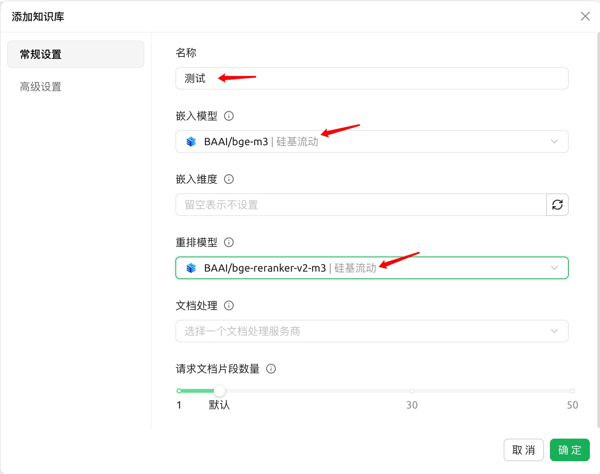
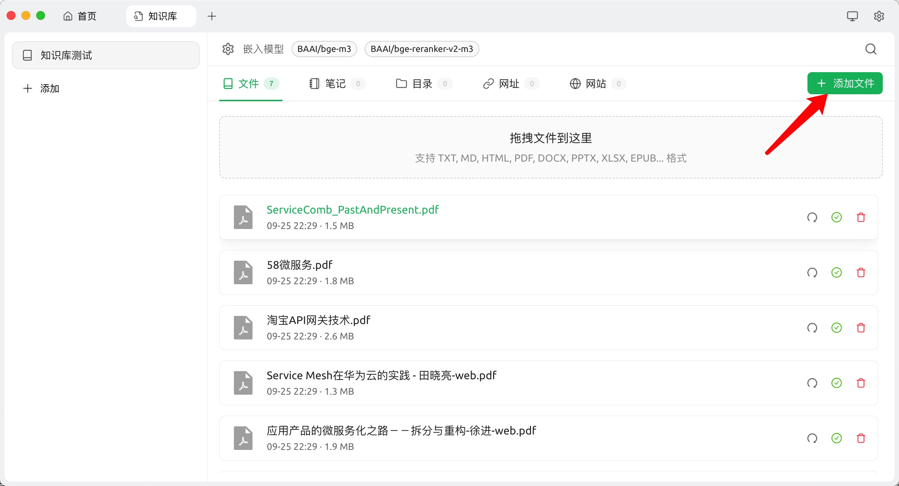
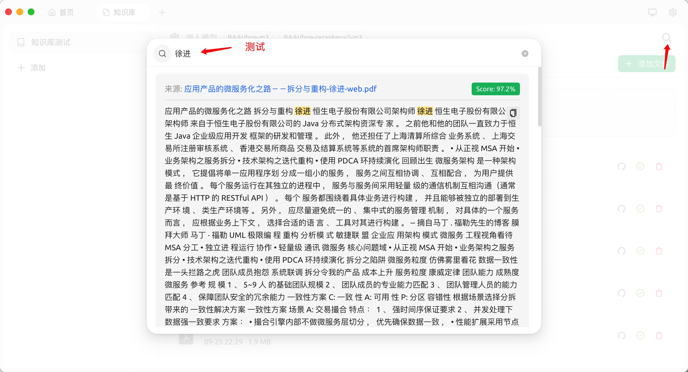
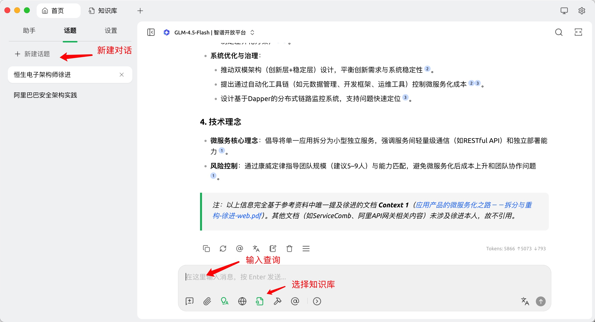

# 作业6
搭建个人知识库RAG系统
作业要求
至少包含10个文档
支持中文问答
提交内容

提供GiHub仓库链接
系统演示视频
实现基本的检索增强生成功能
提示:可以基于课程中提供的代码示例，添加更多文档并优化检索效果

## 添加模型

## 添加知识库

## 导入数据-数据向量化

## 向量测试

## 知识库验证

## 操作视频
[操作视频](https://github.com/scott20050218/HA6/blob/main/%E6%BC%94%E7%A4%BA%E8%A7%86%E9%A2%91.mov)
